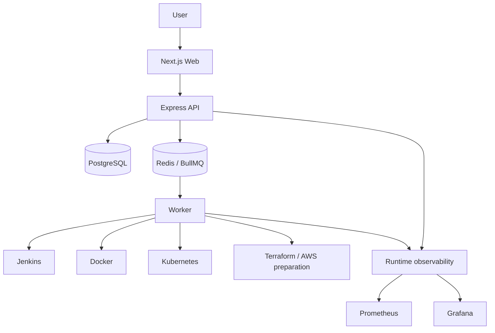
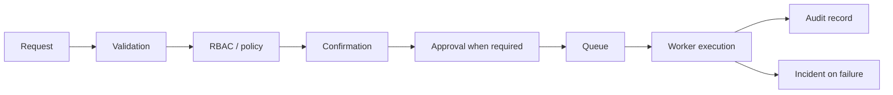

# AutoOps 2.0

[](https://github.com/Pramu55/AutoOps-2.0/actions/workflows/ci.yml)

AutoOps is a production-style DevOps control plane and portfolio project built
to demonstrate CI/CD, Docker, Kubernetes, Terraform, Jenkins, GitHub Actions,
PostgreSQL, Redis and BullMQ, Prometheus and Grafana, RBAC, approval gates,
audit evidence, incidents, runbooks, and governed operations.

It is designed for DevOps, SRE, CI/CD, cloud, and platform engineering
interviews. AutoOps is not an autonomous auto-fix bot; it prepares and governs
operations through validation, confirmation, approval, queueing, worker
execution, and audit records.

## Recruiter Quick Overview

| Area           | Summary                                                                                                                                   |
| -------------- | ----------------------------------------------------------------------------------------------------------------------------------------- |
| Role relevance | Junior DevOps Engineer, Cloud DevOps Engineer, Junior SRE, CI/CD Engineer, Junior Platform Engineer                                       |
| Main problem   | Bring fragmented operational workflows into one governed control plane with safe execution and incident follow-up                         |
| Core skills    | CI/CD, Docker, Kubernetes, Terraform readiness, Jenkins, GitHub Actions, PostgreSQL, Redis/BullMQ, RBAC, observability, incident response |
| Project status | Local-first, company-evaluator-ready portfolio project; not production-certified or enterprise-certified                                  |
| Local demo     | Docker Compose local stack with web, API, worker, PostgreSQL, Redis, Prometheus, and Grafana                                              |

## Architecture



AutoOps separates governance from execution. The web console presents workflows,
the API owns authentication, tenant scope, RBAC, policy, approval, queueing, and
safe DTOs, and the worker performs approved actions through controlled provider
connectors.

## Delivery Workflow



## Skills Demonstrated

| Skill                         | AutoOps evidence                                                                                                                        |
| ----------------------------- | --------------------------------------------------------------------------------------------------------------------------------------- |
| Linux/runtime troubleshooting | Local service health checks, worker heartbeat, queue status, runbooks, and failure-to-incident workflows                                |
| Git and GitHub                | Monorepo, branch-based development, pull request checklist, GitHub Actions workflow visibility, and release gates                       |
| CI/CD                         | GitHub Actions quality build, local release checks, typecheck/build/test/secret-scan flow, Jenkins status and allowlisted build trigger |
| Docker                        | Docker Compose local stack, Docker connector status/inventory/logs, governed start/stop/restart operations                              |
| Kubernetes                    | Kubernetes connector for status, metrics readiness, namespaces, workloads, pods, services, scale, and rollout restart                   |
| Terraform                     | Infrastructure Automation Center, allowlisted validate/plan/apply model, proof infrastructure preparation, plan/apply separation        |
| AWS governance preparation    | Secret-safe AWS and Terraform readiness packages with explicit identity, plan, apply, and cost boundaries                               |
| Observability                 | Operations Hub, Prometheus/Grafana-ready stack, queue health, worker heartbeat, provider health, incident correlation                   |
| Security                      | Authenticated API, organization scope, RBAC, requester/approver separation, confirmation tokens, redacted DTOs                          |
| Incident response             | Failed operations become incidents with timeline, deterministic runbooks, and governed remediation preparation                          |
| Backend/platform engineering  | Express API, Prisma/PostgreSQL, Redis/BullMQ worker execution, safe connectors, audit evidence, tenant-scoped services                  |

## Verified Engineering Outcomes

- TypeScript monorepo with Next.js web, Express API, worker, shared packages,
  Prisma, and Turborepo.
- Tenant-scoped data for projects, deployments, operations, audit records,
  incidents, and governance evidence.
- Authenticated API with RBAC and requester/approver separation.
- Governed operations using validation, confirmation tokens, approval gates,
  queueing, worker execution, and audit records.
- Worker-backed execution through BullMQ and Redis.
- CI checks for install, builds, typechecks, tests, secret scan, and whitespace.
- Jenkins, Docker, Kubernetes, infrastructure automation, GitHub Actions, and
  observability integration surfaces.
- Incident correlation from failed operations to safe runbooks.
- Terraform proof infrastructure and AWS identity/credential readiness
  preparation without claiming live AWS resources.
- Secret-safe workflows, documented rollback boundaries, and explicit approval
  boundaries.

## Quick Install

To run AutoOps locally with Docker Compose, open Windows PowerShell and run:

```powershell
git clone https://github.com/Pramu55/AutoOps-2.0.git
cd AutoOps-2.0
copy .env.example .env
docker compose -f docker-compose.yml -f docker-compose.k8s.yml up -d --build
```

Local URLs:

- Web Dashboard: [http://localhost:3000](http://localhost:3000)
- API Health Check: [http://localhost:4000/health](http://localhost:4000/health)
- Grafana: [http://localhost:3001](http://localhost:3001)
- Prometheus: [http://localhost:9090](http://localhost:9090)

Provider credentials are optional and are not bundled. Unconfigured providers
show honest `NOT_CONFIGURED` or policy-blocked states instead of fake data. Do
not commit `.env` or credentials.

For details, see [Docker Compose Deployment Guide](./docs/DOCKER_INSTALL.md).

## Recruiter Demo Path

1. Open the dashboard and review platform status.
2. Inspect Operations Hub for queue, worker, provider, approval, and failure
   visibility.
3. Inspect provider readiness for Jenkins, Docker, Kubernetes, infrastructure,
   GitHub Actions, and observability surfaces.
4. Inspect incidents and runbooks to see how failed operations are handled.
5. Review the CI badge and architecture docs.

## Safety Status

- No live AWS infrastructure is required for the portfolio.
- AWS credentials are not bundled.
- The current repository state does not claim active AWS resources.
- Cloud operations remain approval-gated.
- Terraform plan and apply remain separate approval boundaries.
- AutoOps is intentionally not an autonomous auto-fix bot.

## Portfolio Links

- GitHub: [AutoOps 2.0](https://github.com/Pramu55/AutoOps-2.0)
- Portfolio: [Pramod S S Portfolio](https://personal-portfolio-phi-henna-97.vercel.app)
- LinkedIn: [Pramod S S](https://www.linkedin.com/in/pramod-s-s-268abb331)

Author: Pramod S S, Bengaluru, MCA Graduate

Target roles: Junior DevOps Engineer, Cloud DevOps Engineer, Junior SRE, CI/CD
Engineer, and Junior Platform Engineer.

## Final Documentation

- [AutoOps Final DevOps Portfolio Release](./docs/DEVOPS_PORTFOLIO_RELEASE.md)
- [AutoOps Interview Project Guide](./docs/INTERVIEW_PROJECT_GUIDE.md)
- [Architecture Overview](./docs/ARCHITECTURE_OVERVIEW.md)
- [Evaluator Quickstart](./docs/EVALUATOR_QUICKSTART.md)
- [AutoOps Demo Script](./docs/AUTOOPS_DEMO_SCRIPT.md)
- [Limitations and Roadmap](./docs/LIMITATIONS_AND_ROADMAP.md)

## Current Status and Limitations

AutoOps is a local-first, company-evaluator-ready portfolio project. It is not
enterprise-certified, production-certified, or backed by active production
customers. Future production work would include stronger identity integration,
managed secrets, broader test coverage, hosted deployment hardening, and
production-grade cloud operations review.
