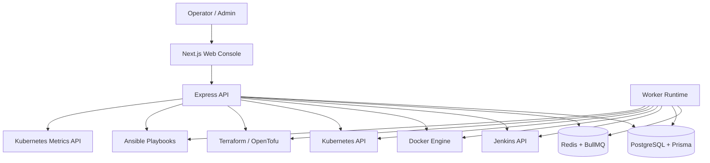
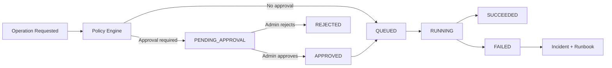
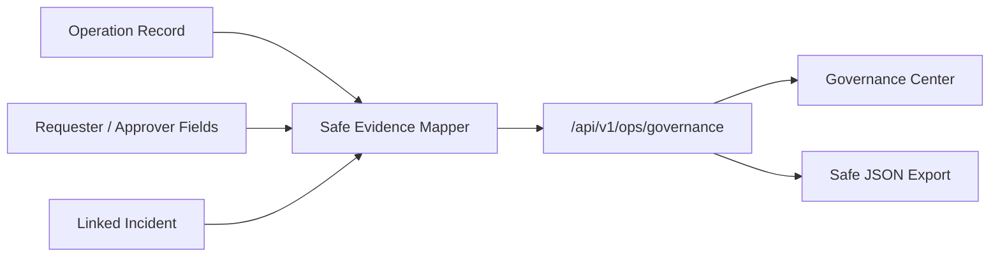

# AutoOps Architecture Overview

## Executive Summary

AutoOps is a local-first, production-style DevOps Control Plane. It connects a Next.js console, Express API, PostgreSQL, Redis/BullMQ, and a worker runtime to governed Jenkins, Docker, Kubernetes, Terraform/OpenTofu, and Ansible operations.

## Architecture Goals

- Keep user intent, policy, approval, and execution separate.
- Make all operation state durable and auditable.
- Use real provider data without exposing secrets.
- Keep optional integrations optional.
- Avoid unsafe generic automation paths.
- Make release gates repeatable.

## Monorepo Structure

| Path | Purpose |
| --- | --- |
| `apps/web` | Next.js console |
| `apps/api` | Express API and integration controllers |
| `apps/worker` | BullMQ workers and runtime heartbeat |
| `packages/database` | Prisma schema/client/seed |
| `packages/types` | Shared DTOs and enums |
| `packages/utils` | Shared utilities including redaction and Docker client |
| `packages/logger` | Safe logger setup |
| `scripts` | Local start/stop/release/backup/restore checks |
| `docs` | Deployment, security, CI, demo, and evaluator docs |

## High-Level Architecture

## Web Application

The web app provides the authenticated AutoOps console. It shows dashboard overview, Operations Hub, incidents, Jenkins, Docker, Kubernetes, Infrastructure Automation, projects, deployments, operation detail, and command search.

The web app is a client of the API only. It does not own security decisions.

## API Service

The API owns:

- authentication
- organization context
- RBAC decisions
- policy evaluation
- confirmation token validation
- approval/rejection
- operation record creation
- safe DTO mapping
- incident lifecycle
- provider status and inventory reads
- queue and worker observability

## Worker Service

The worker owns execution after the API accepts and queues an operation. It executes Jenkins build triggers, Docker container actions, Kubernetes scale, Kubernetes rollout restart, Terraform/OpenTofu workflows, and Ansible workflows through controlled code paths only.

## PostgreSQL and Prisma

PostgreSQL stores users, organizations, projects, deployments, operations, audit records, worker heartbeat rows, incidents, and incident events. Prisma provides typed access and migrations.

## Redis and BullMQ

Redis backs BullMQ queues for deployments, operations, and system jobs. Queue health is reported when safely readable.

## Authentication and Organization Context

Users authenticate through the real auth API. Organization membership determines role and tenant scope. Demo accounts are seeded only for local demo/testing.

## RBAC and Authorization

Operation trigger roles are OWNER, ADMIN, and MEMBER. Approval roles are OWNER and ADMIN. VIEWER cannot trigger or approve. Requesters cannot approve or reject their own approval-required operations.

## Operation Policy Engine

The policy engine decides risk, confirmation token, and approval requirement. Examples:

- Jenkins BUILD: confirmation only.
- Docker START: confirmation only.
- Docker STOP/RESTART: approval required.
- Kubernetes SCALE above 2 replicas: approval required.
- Terraform/OpenTofu VALIDATE and PLAN: confirmation only.
- Terraform/OpenTofu APPLY: approval required.
- Ansible SYNTAX and CHECK: confirmation only.
- Ansible RUN: approval required.
- Unknown operation type: approval required.

## Approval Workflow

## Operation Lifecycle

Operations move through pending approval, queued, running, succeeded, failed, rejected, or cancelled states. Operation detail shows safe lifecycle and governance fields without raw metadata.

## Jenkins Connector

Jenkins reads status, jobs, and builds. It can trigger allowlisted jobs only with `BUILD` confirmation. No script console or arbitrary job mutation is exposed.

## Docker Connector

Docker reads status, containers, images, networks, volumes, and logs. It can start, stop, and restart containers with confirmation and approval policy. No exec, shell, delete, create/run, or unsafe image/volume/network actions are exposed.

## Kubernetes Connector

Kubernetes reads cluster status, Metrics API status, namespaces, workloads, pods, services, and rollout status. It can scale and rollout restart deployments with confirmation and approval policy. Protected namespaces are blocked.

## Infrastructure Automation Connector

Infrastructure automation reads allowlisted Terraform/OpenTofu workspaces and Ansible playbooks from configured roots. It can validate, plan, syntax-check, and check mode without approval. Terraform/OpenTofu apply and Ansible run require approval before the worker executes fixed command definitions. No arbitrary command string, shell UI, SSH key, vault secret, cloud credential, Terraform state, or arbitrary path execution is exposed.

Day 20 ecosystem readiness adds read-only GitHub Actions, Prometheus/Grafana, DevOps tooling, and cloud-provider readiness checks. These modules are API-owned, authenticated, and intentionally do not create direct mutation paths.

## Worker Heartbeat Registry

Workers persist service, process id, queues, status, started time, and last seen time. Operations Hub derives fresh/stale/offline worker posture from heartbeat age.

## Observability

Operations Hub combines platform health, provider health, queue health, worker runtime, operation activity, pending approvals, failures, and incidents.

## Incidents and Runbooks

Failed operations create tenant-scoped incidents. Incidents have OPEN, ACKNOWLEDGED, and RESOLVED lifecycle. Runbooks are deterministic, safe, and provider-aware.

## Governance Center and Evidence Flow

Governance Center derives audit-style evidence from existing operation, approval, worker, and incident records. It is review-ready evidence, not a certification claim or immutable ledger.

Evidence includes requester, approver/rejecter, policy, risk, approval status, provider, target, lifecycle timing, incident linkage, and safe result/error summaries. It omits raw input, raw provider result objects, raw error objects, stack traces, environment values, tokens, kubeconfig, Authorization headers, and secret-like metadata.

## Security Boundaries

- API owns governance.
- Worker owns execution.
- Frontend permission hints are not security.
- Secrets are redacted.
- Raw provider metadata is not exposed.
- Unsafe controls are intentionally not implemented.

## Production Deployment Topology

`docker-compose.prod.yml` provides a production-like company pilot topology with web, API, worker, Postgres, and Redis. Postgres and Redis stay internal. Optional Docker socket, kubeconfig, and infrastructure workspace mounts are not enabled by default.

## CI/Release Architecture

GitHub Actions validates install, database build, shared types, API typecheck/build/test, worker typecheck/build, web typecheck/build, secret scan, and whitespace. CI does not require Jenkins, Docker socket, kubeconfig, or real secrets.

## Future Architecture Improvements

- More automated tests.
- Notification integrations.
- External identity provider integration.
- Audit export and retention controls.
- Cloud deployment guide.
- GitHub and AWS connectors.
- Optional AI assistant with safe guardrails.
