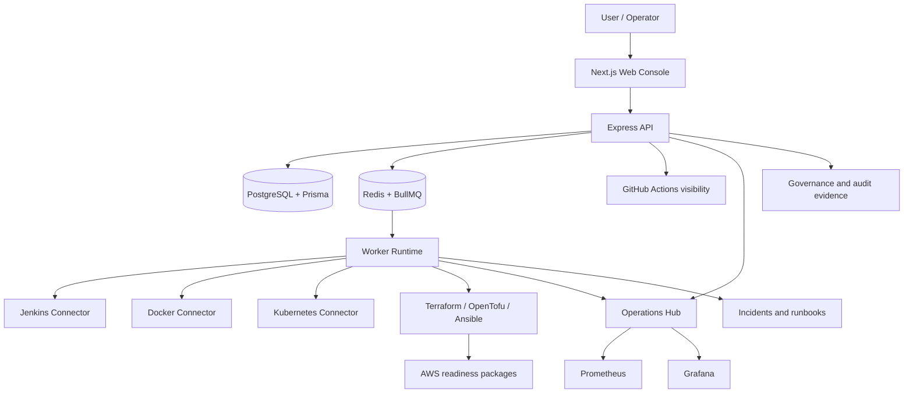

# AutoOps Final DevOps Portfolio Release

## Executive Summary

AutoOps is a production-style DevOps control plane built as a final portfolio
project for junior DevOps, SRE, cloud, CI/CD, and platform engineering roles. It
combines a Next.js console, Express API, PostgreSQL, Redis/BullMQ worker
execution, Docker Compose runtime, Jenkins, Docker, Kubernetes, Terraform/OpenTofu
automation surfaces, GitHub Actions visibility, Prometheus/Grafana readiness,
RBAC, approval gates, audit evidence, incidents, and runbooks.

The release is documentation-focused and job-focused. It does not claim active
production customers, production certification, enterprise certification, or
currently running AWS infrastructure.

## Problem Solved

Real operations work is split across dashboards, CI tools, container platforms,
cluster tools, infrastructure code, queues, logs, and incident notes. AutoOps
shows how those concerns can be brought into one governed platform without
turning the system into an unsafe auto-remediation bot.

The core problem solved is safe operational coordination: a user requests an
action, the platform validates it, policy decides risk and approval, the worker
executes through controlled connectors, and the system keeps audit and incident
evidence.

## Target Job Roles

| Role                     | Why AutoOps is relevant                                                                                 |
| ------------------------ | ------------------------------------------------------------------------------------------------------- |
| Junior DevOps Engineer   | Demonstrates CI/CD, Docker, Jenkins, release checks, scripting, and operational workflows               |
| Cloud DevOps Engineer    | Shows Terraform/AWS readiness, cost boundaries, credential safety, and approval-gated cloud preparation |
| Junior SRE               | Shows incident correlation, runbooks, worker health, queue health, and observability thinking           |
| CI/CD Engineer           | Shows GitHub Actions, Jenkins integration, release gates, secret scan, and build validation             |
| Junior Platform Engineer | Shows internal platform design, RBAC, API/worker separation, tenant scope, and governed operations      |

## Complete Architecture

The web app is the user-facing console. The API owns authentication,
organization context, policy, RBAC, approval, operation records, provider-safe
DTOs, incident lifecycle, and governance evidence. Redis and BullMQ queue work.
The worker performs approved operations and reports lifecycle state. PostgreSQL
stores durable records through Prisma.

## Core Technologies

| Area          | Technology                                                            |
| ------------- | --------------------------------------------------------------------- |
| Frontend      | Next.js 15, React, Tailwind CSS                                       |
| Backend       | Express 4, TypeScript, Zod                                            |
| Data          | PostgreSQL 16, Prisma                                                 |
| Queue         | Redis 7, BullMQ                                                       |
| Worker        | TypeScript worker service                                             |
| Runtime       | Docker Compose                                                        |
| CI/CD         | GitHub Actions, Jenkins integration                                   |
| Containers    | Docker connector and Docker Compose stack                             |
| Orchestration | Kubernetes connector                                                  |
| IaC           | Terraform/OpenTofu readiness and allowlisted infrastructure workflows |
| Observability | Operations Hub, Prometheus, Grafana                                   |
| Governance    | RBAC, approval gates, audit records, incidents, runbooks              |

## DevOps Lifecycle Demonstrated

AutoOps demonstrates a practical lifecycle:

1. Developer pushes code.
2. GitHub Actions runs install, typecheck, build, tests, secret scan, and
   whitespace checks.
3. Local Docker Compose starts the platform.
4. Users inspect runtime status and provider readiness.
5. Operators request controlled actions.
6. RBAC, confirmation, and approval policy decide whether work can proceed.
7. Redis/BullMQ queues approved work.
8. The worker executes through provider-specific code paths.
9. Audit evidence and incidents are recorded.
10. Runbooks guide safe follow-up.

## CI/CD Workflow

The repository includes a GitHub Actions quality workflow and local release
checks. The documented CI checks include dependency install, Prisma generation,
database/shared package build, API typecheck/build/test, worker typecheck/build,
web typecheck/build, secret scan, and whitespace validation.

Jenkins integration is represented as a controlled connector for status, jobs,
builds, and allowlisted build triggers. AutoOps does not expose Jenkins script
console or arbitrary Jenkins mutations.

## Docker And Runtime Workflow

Docker Compose runs the local portfolio stack with web, API, worker,
PostgreSQL, Redis, Prometheus, and Grafana. Docker is also represented as an
operations connector for status, containers, images, networks, volumes, logs,
and governed start/stop/restart controls.

Unsafe Docker operations such as arbitrary shell execution, container deletion,
or broad host mutation are intentionally not presented as generic controls.

## Kubernetes Integration

The Kubernetes connector supports cluster status, Metrics API status,
namespaces, workloads, pods, services, scale, and rollout restart workflows.
Protected namespace behavior and approval policy are part of the safety model.

AutoOps does not claim to be a full Kubernetes management suite. It demonstrates
how a platform can expose useful Kubernetes operations while keeping mutation
paths governed.

## Terraform And AWS Readiness

AutoOps includes infrastructure automation documentation and Terraform/OpenTofu
workflow design for allowlisted validate, plan, and approval-gated apply
operations. The AWS proof infrastructure preparation documents a limited
ten-resource proof scope and explicit plan/apply boundaries.

AWS readiness is secret-safe and offline in the repository. Credentials are not
bundled, live AWS resources are not claimed, and AWS identity, Terraform plan,
and Terraform apply are separate approval gates.

## Observability

Operations Hub combines runtime health, provider status, queue health, worker
heartbeat, operation activity, pending approvals, failures, and incident
visibility. Prometheus and Grafana are included in the local observability-ready
stack.

The project demonstrates observability as operational context, not just charts:
queue state, worker state, provider readiness, failed operations, and incident
links are part of the same workflow.

## Security And Governance

AutoOps security is centered on API-owned decisions:

- Authenticated API access.
- Organization-scoped data.
- RBAC for operation trigger and approval roles.
- Requester/approver separation.
- Confirmation tokens for controlled operations.
- Policy-based approval gates.
- Worker-only execution.
- Safe DTO mapping and secret redaction.
- Governance evidence that avoids raw secret material.

Frontend permission hints are not treated as the security boundary.

## Incident Response

Failed operations can become tenant-scoped incidents. Incidents include status,
events, evidence, and deterministic runbook guidance. Recommended remediation is
governed preparation, not autonomous repair.

This is important for SRE and DevOps interviews because it shows the difference
between detecting a failure, explaining it, preparing a safe action, and
actually executing a change.

## Troubleshooting Examples

### Worker/Queue Processing Failure

- Symptom: An operation stays queued or does not complete.
- Investigation: Check Operations Hub queue health, worker heartbeat, operation
  detail, and worker logs in the local runtime.
- Root cause category: Worker unavailable, Redis unavailable, queue backlog, or
  provider execution error.
- Safe fix approach: Restart only the affected local service, verify Redis and
  worker configuration, then retry through the governed operation flow.
- Verification: Worker heartbeat becomes fresh and the operation moves to a
  terminal status.
- DevOps lesson: Execution should be separated from request handling and made
  observable.

### Provider Not Configured

- Symptom: A connector displays `NOT_CONFIGURED`.
- Investigation: Review provider readiness and required local environment setup
  without printing secrets.
- Root cause category: Optional connector credentials or runtime access are not
  configured.
- Safe fix approach: Configure only the required local connector values outside
  Git and restart the relevant local service.
- Verification: Provider status changes from `NOT_CONFIGURED` to a healthy or
  reachable state.
- DevOps lesson: Honest unavailable states are safer than fake dashboards.

### Docker Service Health Failure

- Symptom: Web, API, worker, PostgreSQL, Redis, Prometheus, or Grafana is not
  reachable in the local stack.
- Investigation: Check the Docker Compose service state, health endpoint, and
  logs for the affected service.
- Root cause category: Container startup failure, dependency readiness, port
  conflict, or environment configuration issue.
- Safe fix approach: Fix the local configuration or restart the affected service
  without deleting data volumes unless explicitly approved.
- Verification: Health checks pass and the dashboard/API endpoint is reachable.
- DevOps lesson: Runtime health needs both service-level and dependency-level
  checks.

### Kubernetes Connector Unavailable

- Symptom: Kubernetes pages show unavailable or blocked connector state.
- Investigation: Check whether Kubernetes access is configured, whether Metrics
  API is available, and whether the organization is allowed to view provider
  inventory.
- Root cause category: Missing kubeconfig/runtime mount, cluster unavailable,
  Metrics API absent, or provider inventory policy blocked.
- Safe fix approach: Restore approved local cluster access or keep the connector
  disabled; do not bypass RBAC or provider access policy.
- Verification: Status endpoints report safe cluster readiness without exposing
  secret configuration.
- DevOps lesson: Platform tools should distinguish missing config from policy
  denial.

### Terraform Generated-Artifact Safety Failure

- Symptom: A static validator reports unexpected Terraform state, plan, cache,
  lock, or generated files.
- Investigation: Inspect the validator message and compare it with the approved
  Terraform readiness boundary.
- Root cause category: Generated artifact created in the repository or an
  unapproved lock/state/plan file.
- Safe fix approach: Stop the workflow and review artifact handling; remove or
  preserve artifacts only through the approved cleanup policy.
- Verification: Static validators pass and no unapproved generated Terraform
  artifacts remain in scope.
- DevOps lesson: Infrastructure automation must protect state, plans, providers,
  and credentials as controlled artifacts.

### Failed Operation Becoming An Incident

- Symptom: A worker-executed operation fails and an incident appears.
- Investigation: Open the operation detail, incident timeline, and runbook
  guidance.
- Root cause category: Provider failure, validation failure, permission issue,
  unavailable runtime, or rejected policy path.
- Safe fix approach: Use the deterministic runbook and prepare any follow-up
  action through the same approval pipeline.
- Verification: Incident status and operation evidence show the response path.
- DevOps lesson: Failure handling should produce evidence, not just logs.

## Important Engineering Decisions

- Split API governance from worker execution.
- Use Redis/BullMQ so operations can be queued, retried, observed, and audited.
- Keep provider integrations optional and honest instead of showing fake data.
- Use RBAC and requester/approver separation for controlled operations.
- Treat Terraform plan and apply as separate gates.
- Avoid autonomous remediation because operational changes need human context
  and approval.
- Keep AWS credentials and live AWS operations outside the repository.

## Verified Capabilities

- Monorepo architecture with web, API, worker, database, shared types, and
  shared utilities.
- Authenticated API and organization-scoped service patterns.
- RBAC, policy, confirmation, approval, and audit evidence.
- Worker-backed operations through Redis/BullMQ.
- Jenkins, Docker, Kubernetes, infrastructure automation, GitHub Actions, and
  observability surfaces.
- Incidents, runbooks, and deterministic remediation preparation.
- CI/release checks and secret scan.
- Terraform proof infrastructure preparation and AWS readiness documentation.

## Honest Limitations

- AutoOps is local-first by default.
- It is not production-certified, enterprise-certified, SOC2-certified, or a
  managed SaaS.
- It does not claim active production customers or currently running AWS
  infrastructure.
- Optional providers depend on local configuration.
- More end-to-end tests and production hardening would be needed for a company
  deployment.
- Real cloud deployment would require managed secrets, identity, network,
  monitoring, backup, and review processes.

## Recruiter Evaluation Path

1. Read the root [README](../README.md).
2. Review [Architecture Overview](./ARCHITECTURE_OVERVIEW.md).
3. Follow [Evaluator Quickstart](./EVALUATOR_QUICKSTART.md).
4. Use [AutoOps Demo Script](./AUTOOPS_DEMO_SCRIPT.md) for a short demo.
5. Check [Limitations and Roadmap](./LIMITATIONS_AND_ROADMAP.md) for honest
   scope.
6. Use [Interview Project Guide](./INTERVIEW_PROJECT_GUIDE.md) for technical
   discussion.

## Resume-Ready Project Description

Developed AutoOps, a production-style DevOps control plane using Next.js,
Express, PostgreSQL, Redis, BullMQ, Docker, Kubernetes, Terraform, Jenkins, and
GitHub Actions. Implemented RBAC, approval-gated operations, worker-based
execution, audit logging, provider integrations, incident workflows, monitoring,
and release validation. Designed secret-safe AWS and Terraform readiness
controls with explicit identity, plan, apply, cost, and rollback boundaries.

## LinkedIn-Ready Project Description

I built AutoOps as a production-style DevOps control plane and final portfolio
project for DevOps, SRE, cloud, CI/CD, and platform engineering roles. The
project brings together a Next.js dashboard, Express API, PostgreSQL, Redis and
BullMQ workers, Docker Compose, Jenkins, Kubernetes, Terraform/OpenTofu
workflows, GitHub Actions visibility, Prometheus/Grafana readiness, RBAC,
approval gates, audit evidence, incidents, and runbooks. My goal was to show how
real operations can be made safer: requests are validated, risky actions require
confirmation and approval, workers execute controlled operations, and failures
produce incident evidence instead of disappearing into logs. I also documented
secret-safe Terraform and AWS readiness boundaries so the project is honest
about cloud risk and cost. AutoOps is local-first and portfolio-focused, but it
models the engineering habits I would bring to a DevOps team: safety, clarity,
automation, observability, and disciplined release gates.

## Final Status

AutoOps is ready to be presented as a final job-focused DevOps portfolio
release. The repository demonstrates credible platform engineering breadth while
staying honest about limitations, local-first status, and approval-gated cloud
boundaries.
