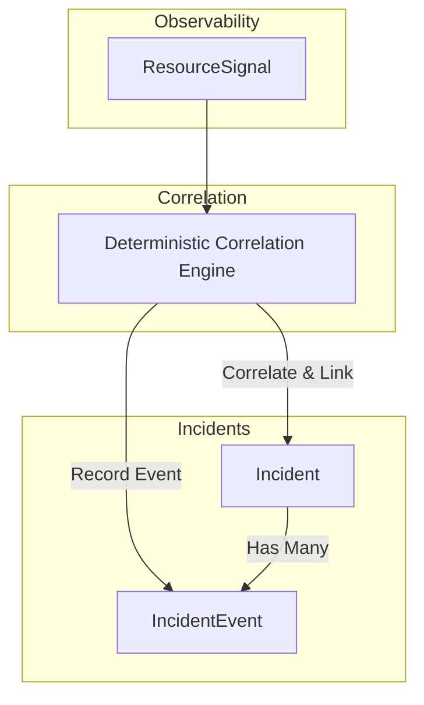

# Incident Workflow and Timeline

AutoOps provides a deterministic, tenant-scoped incident workflow and timeline to track incident events and allow operators to add workflow notes.

## Architecture

### IncidentEvent Model

The `IncidentEvent` model captures all state changes, correlation updates, evidence linking, and operator notes in a transactional, audit-safe structure.

- **ID**: UUID primary key.
- **Organization ID**: Cascading relation to `Organization` ensuring strict tenant isolation.
- **Incident ID**: Cascading relation to the parent `Incident`.
- **Type**: `IncidentEventType` enum:
  - `INCIDENT_OPENED`: Recorded when an incident is first created by the correlation engine.
  - `INCIDENT_UPDATED`: Recorded when details are updated or evidence is added.
  - `SIGNAL_LINKED`: Recorded when a new signal is linked as evidence.
  - `SEVERITY_CHANGED`: Recorded when severity escalates due to linked signals.
  - `STATUS_CHANGED`: Recorded when status changes (e.g. OPEN -> ACKNOWLEDGED).
  - `ACKNOWLEDGED`: Recorded when an operator acknowledges the incident.
  - `RESOLVED`: Recorded when an operator resolves the incident.
  - `ARCHIVED`: Recorded when an operator archives the incident.
  - `NOTE_ADDED`: Recorded when an operator adds a workflow/evidence note.
- **Actor User ID / Email**: Identifies the operator performing the action.
- **Title**: Short description of the event.
- **Message**: Detailed description of the event or note body.
- **Metadata**: JSON object containing event context.
- **Timestamps**: `occurredAt` and `createdAt` with microsecond precision.

## Tenant Isolation & Safety

1. **Strict Scoping**: Every database query for `IncidentEvent` is scoped by `organizationId` matching `req.auth.orgId`.
2. **Transactional Lifecycle**: Actions like Acknowledge, Resolve, and Archive are performed inside a single Prisma `$transaction` so the state change and timeline event recording are atomic.
3. **No AI/Automation Actions**: We explicitly avoid automated remediation, runbook executions, or AI summary generation. Everything is recorded deterministically.
