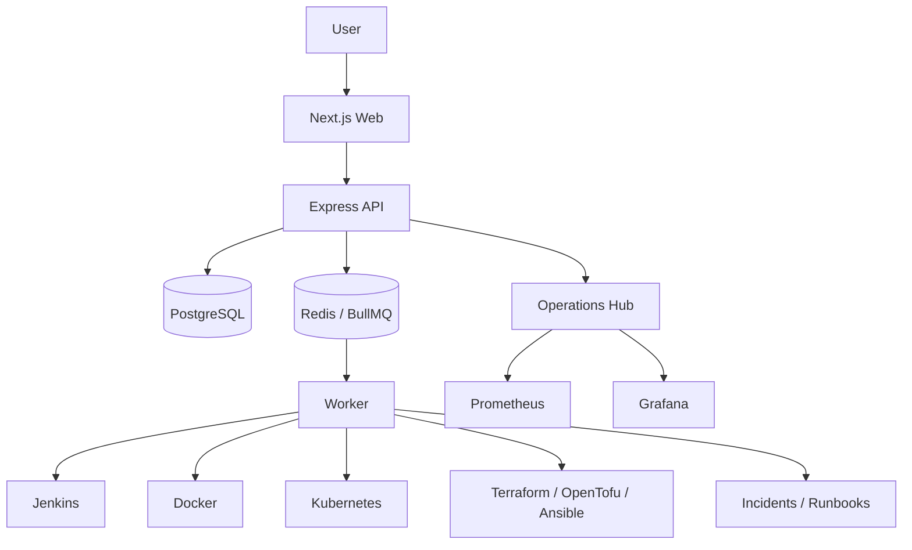

# AutoOps Interview Project Guide

This guide is written for Pramod S S to study and speak naturally in interviews.
Use it as a speaking aid, not a script to memorize word for word.

## 30-Second Explanation

AutoOps is my production-style DevOps control plane portfolio project. It brings
together a Next.js dashboard, Express API, PostgreSQL, Redis/BullMQ worker
execution, Docker, Kubernetes, Jenkins, Terraform readiness, GitHub Actions,
Prometheus/Grafana readiness, RBAC, approval gates, audit evidence, incidents,
and runbooks. The main idea is safe operations: users can request actions, but
the platform validates them, applies policy, requires confirmation or approval
when needed, queues the work, executes it through a worker, and records evidence.

## 2-Minute Explanation

I built AutoOps to show the kind of work a DevOps or platform team does beyond
basic deployment scripts. In real teams, operations are spread across CI tools,
Docker, Kubernetes, infrastructure code, dashboards, and incident notes. AutoOps
connects those ideas into one governed control plane.

The web app is built with Next.js. The backend is an Express API with Prisma and
PostgreSQL. Redis and BullMQ power background operation queues, and a separate
worker executes approved operations. The platform includes connectors and
readiness surfaces for Jenkins, Docker, Kubernetes, GitHub Actions,
Terraform/OpenTofu, AWS preparation, Prometheus, and Grafana.

The most important part is safety. AutoOps is not an autonomous remediation bot.
It uses RBAC, tenant isolation, confirmation tokens, approval gates, worker-only
execution, audit records, and incidents. If an operation fails, the failure can
become an incident with a deterministic runbook. That shows how I think about
reliability, governance, and practical DevOps operations.

## 5-Minute Technical Explanation

AutoOps is a TypeScript monorepo with three main runtime services: web, API, and
worker. The web app handles user workflows, but the API owns all security
decisions. The API authenticates users, derives organization scope, checks RBAC,
validates requests, evaluates operation policy, creates operation records, and
queues approved work. PostgreSQL stores durable records through Prisma. Redis
and BullMQ are used for queues. The worker consumes jobs and executes fixed,
provider-specific code paths.

For integrations, AutoOps supports Jenkins status and allowlisted build
triggers, Docker status/inventory/logs and governed start/stop/restart,
Kubernetes status/inventory/scale/rollout restart, infrastructure automation
workflows for Terraform/OpenTofu and Ansible, GitHub Actions visibility, and
observability readiness through Prometheus/Grafana surfaces. Optional providers
are honest: if something is not configured, the UI and API show that instead of
pretending data exists.

The operation lifecycle is the heart of the system. A request enters the API,
validation checks the shape and target, RBAC checks the role, policy decides
risk, confirmation may be required, approval may be required, and then the
operation goes to the queue. The worker runs it and updates lifecycle status. On
failure, the platform can create an incident and attach runbook guidance.

For Terraform and AWS, I focused on readiness and guardrails. Plan and apply are
separate. AWS identity and credential use are separate. The repository does not
bundle credentials and does not claim live AWS infrastructure.

## Architecture Walkthrough

When I explain the diagram, I emphasize separation of concerns: web for user
experience, API for governance, database for durable state, queue for async
work, worker for execution, and connectors for controlled provider actions.

## Request-To-Execution Lifecycle

1. User requests an operation.
2. API validates input and tenant context.
3. RBAC checks whether the role can request the operation.
4. Policy decides risk, confirmation, and approval requirement.
5. User provides the exact confirmation token when required.
6. Owner/admin approval is required for higher-risk operations.
7. BullMQ queues the operation.
8. Worker executes a fixed provider action.
9. Operation status and audit evidence are updated.
10. Failure can create an incident and runbook path.

## CI/CD Explanation

AutoOps uses GitHub Actions as the main repository quality gate. The documented
workflow validates install, Prisma generation, builds, typechecks, focused API
tests, worker/web builds, secret scan, and whitespace. Jenkins is included as an
operations connector for status, jobs, builds, and allowlisted build triggers.

How I say it: "CI protects the codebase, while Jenkins demonstrates how an
operations platform can safely interact with an existing CI server."

## Docker Explanation

Docker is used in two ways. First, Docker Compose runs the local AutoOps stack:
web, API, worker, PostgreSQL, Redis, Prometheus, and Grafana. Second, AutoOps has
a Docker connector that can read Docker status, inventory, and logs and perform
governed start/stop/restart actions.

Unsafe Docker controls like arbitrary shell access are intentionally not exposed.

## Kubernetes Explanation

The Kubernetes connector reads cluster status, Metrics API readiness,
namespaces, workloads, pods, services, scale status, and rollout status. It can
prepare governed scale and rollout restart operations. Kubernetes access is
treated as optional and policy-controlled.

In an interview, I would say: "I wanted to show Kubernetes operational thinking,
but with guardrails instead of giving the UI dangerous generic kubectl access."

## Terraform/AWS Explanation

AutoOps includes infrastructure automation and Terraform/AWS readiness
documentation. Terraform/OpenTofu validate and plan are treated differently from
apply. Apply requires stricter approval. AWS identity and credential use are
also separate gates.

I do not claim active AWS infrastructure. The repository is secret-safe:
credentials are not bundled, account IDs and ARNs are treated as sensitive
operational metadata, and cloud actions are approval-gated.

## Observability Explanation

Observability in AutoOps is shown through Operations Hub, provider status, queue
health, worker heartbeat, operation lifecycle, failures, incidents, and
Prometheus/Grafana readiness. The goal is to connect telemetry to action and
incident response, not just display charts.

## Security Explanation

Security is enforced in the API and services, not only in the frontend. The
project includes authentication, organization scope, RBAC, requester/approver
separation, confirmation tokens, safe DTOs, secret redaction, provider inventory
boundaries, and audit evidence. New organizations do not automatically inherit
shared provider inventory.

## Incident Response Explanation

When an operation fails, AutoOps can create a tenant-scoped incident. The
incident has lifecycle status, timeline evidence, and deterministic runbook
guidance. Recommended remediation prepares governed actions instead of executing
an automatic fix. That is a deliberate safety choice.

## Most Difficult Engineering Decisions

- Keeping the API as the governance boundary while the worker owns execution.
- Avoiding fake provider data while still making optional integrations easy to
  demo.
- Designing tenant isolation for both tenant-owned data and shared local
  provider inventory.
- Separating confirmation, approval, queueing, execution, audit, and incidents.
- Treating Terraform plan, Terraform apply, AWS identity, and credential access
  as separate boundaries.
- Choosing deterministic remediation guidance instead of autonomous fixes.

## Honest Limitations

AutoOps is local-first and portfolio-focused. It is not production-certified,
enterprise-certified, SOC2-certified, or a managed SaaS. It does not claim active
production customers or current running AWS infrastructure. A real company
deployment would need managed secrets, hardened identity, production monitoring,
backup policies, more end-to-end tests, cloud networking review, and operational
ownership.

## What I Would Build Next In A Real Company

- External identity provider integration.
- Managed secret storage.
- More end-to-end and integration tests.
- Role profiles tailored for real teams.
- Hosted deployment architecture with TLS and backup/restore.
- Per-tenant provider credentials.
- Notification integrations such as Slack or email.
- Stronger audit export and retention controls.
- Cloud deployment runbooks reviewed by senior engineers.

## Common Interviewer Questions And Strong Answers

| Question                                                         | Strong answer                                                                                                                                                                                     |
| ---------------------------------------------------------------- | ------------------------------------------------------------------------------------------------------------------------------------------------------------------------------------------------- |
| Why AutoOps?                                                     | I built it to demonstrate practical DevOps platform thinking: CI/CD, runtime operations, governance, observability, and incident response in one project.                                         |
| Why BullMQ?                                                      | BullMQ gives a clear queue between request handling and execution. It makes worker execution observable and avoids doing risky work inside the API request path.                                  |
| Why separate API and worker?                                     | The API should own validation, RBAC, policy, and audit records. The worker should own execution. This keeps governance and runtime operations separate.                                           |
| How does RBAC work?                                              | Roles decide who can trigger or approve operations. OWNER, ADMIN, and MEMBER can request supported operations, while OWNER and ADMIN can approve. VIEWER is blocked from triggering or approving. |
| How is tenant isolation enforced?                                | API services use the authenticated organization context. Tenant-owned queries filter by organization, and controllers do not trust organization IDs from request bodies.                          |
| How are secrets protected?                                       | Secrets are not bundled, `.env` is ignored, DTOs redact sensitive data, governance exports omit raw secret material, and secret scans are part of release checks.                                 |
| What happens when an operation fails?                            | The worker updates operation status to failed, and the system can create a linked incident with timeline evidence and runbook guidance.                                                           |
| How are approvals enforced?                                      | Policy decides whether approval is needed. Approval-required operations wait until an authorized approver approves them, and self-approval is blocked.                                            |
| Why not autonomous remediation?                                  | Real operations need context and human responsibility. AutoOps can recommend or prepare safe actions, but it does not bypass approvals or execute fixes blindly.                                  |
| How is Docker used?                                              | Docker Compose runs the local stack, and the Docker connector exposes governed status, inventory, logs, and start/stop/restart operations.                                                        |
| How is Kubernetes integrated?                                    | The connector reads safe cluster and workload information and supports governed scale and rollout restart workflows.                                                                              |
| How is Terraform controlled?                                     | Terraform/OpenTofu workflows are allowlisted. Validate and plan are separate from apply, and apply requires approval. Generated artifacts and credentials are treated carefully.                  |
| Why is apply separate from plan?                                 | A plan is review evidence. Apply mutates infrastructure. Keeping them separate reduces risk and gives humans a review checkpoint.                                                                 |
| How is observability implemented?                                | Operations Hub combines provider health, queue health, worker heartbeat, operation activity, failures, incidents, and Prometheus/Grafana readiness.                                               |
| What would change for real production?                           | I would add managed identity, secret manager integration, stronger network security, production monitoring, backups, more tests, and formal operational ownership.                                |
| How would this deploy to AWS?                                    | I would first approve identity and credentials, then run a reviewed Terraform plan, then separately approve apply. I would use managed Postgres/Redis or approved equivalents and proper TLS.     |
| How would you debug queue failure?                               | I would check Redis health, BullMQ queue status, worker heartbeat, operation detail, and worker logs, then restart only the affected service if needed.                                           |
| How would you scale the worker?                                  | I would run multiple worker replicas against the same Redis queue, monitor concurrency and idempotency, and tune queue settings based on workload.                                                |
| How would you secure PostgreSQL and Redis?                       | Use private networking, strong credentials, least privilege, backups, TLS where appropriate, no public exposure, and managed services in production.                                              |
| How does CI protect quality?                                     | CI runs install, builds, typechecks, tests, secret scan, and whitespace checks so broken code or leaked secrets are caught before merge.                                                          |
| How would rollback work?                                         | For app changes, redeploy the last known good image or commit. For infrastructure, review state and use approved rollback or destroy procedures, never casual deletion.                           |
| What did you personally learn?                                   | I learned how important boundaries are: API versus worker, plan versus apply, configured versus not configured, and recommendation versus execution.                                              |
| What trade-offs did you make?                                    | I kept some integrations local-first and focused on safety rather than broad uncontrolled automation. That made the project more credible for DevOps roles.                                       |
| What are the current limitations?                                | It is not a managed SaaS or production-certified system. Optional providers need local configuration, and production would need stronger identity, secrets, monitoring, and tests.                |
| Why does this project qualify you for a junior DevOps role?      | It shows I can build and explain CI/CD, containers, Kubernetes, infrastructure readiness, queues, observability, incidents, and security guardrails in one coherent system.                       |
| How do provider readiness screens behave when config is missing? | They show honest unavailable or policy-blocked states instead of fake data. That helps operators understand what is actually configured.                                                          |
| How does audit evidence work?                                    | The platform records requester, approver, policy, operation status, safe summaries, and incident links while omitting raw secret material.                                                        |
| Why use PostgreSQL with Prisma?                                  | PostgreSQL gives durable relational state, and Prisma provides typed data access for users, organizations, projects, operations, incidents, and audit records.                                    |
| Why use Redis?                                                   | Redis backs BullMQ queues, which is useful for asynchronous operation processing and worker coordination.                                                                                         |
| How do incidents connect to runbooks?                            | Failed operations can create incidents, and the incident view provides deterministic, provider-aware runbook guidance for safe troubleshooting.                                                   |
| How would you explain this to a non-technical recruiter?         | It is a dashboard and backend system that helps teams run DevOps operations safely, with approvals, logs, incidents, and clear evidence.                                                          |
